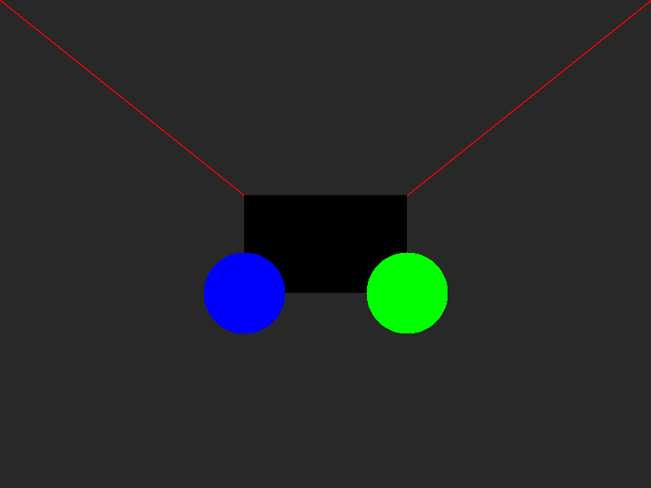

# RUST GL

A really simple CPU graphical library in Rust!

### Inspired by
[Tsoding's Olive.c](https://github.com/tsoding/olive.c)

### Work in Progress

You might not believe it, but this is still under construction! Just a disclaimer.

### Usage

You can edit the main function in [main.rs](./src/main.rs) with your styles, or use some of the example functions in there. Then simply:

```sh
$ cargo run
```

## Gallery




